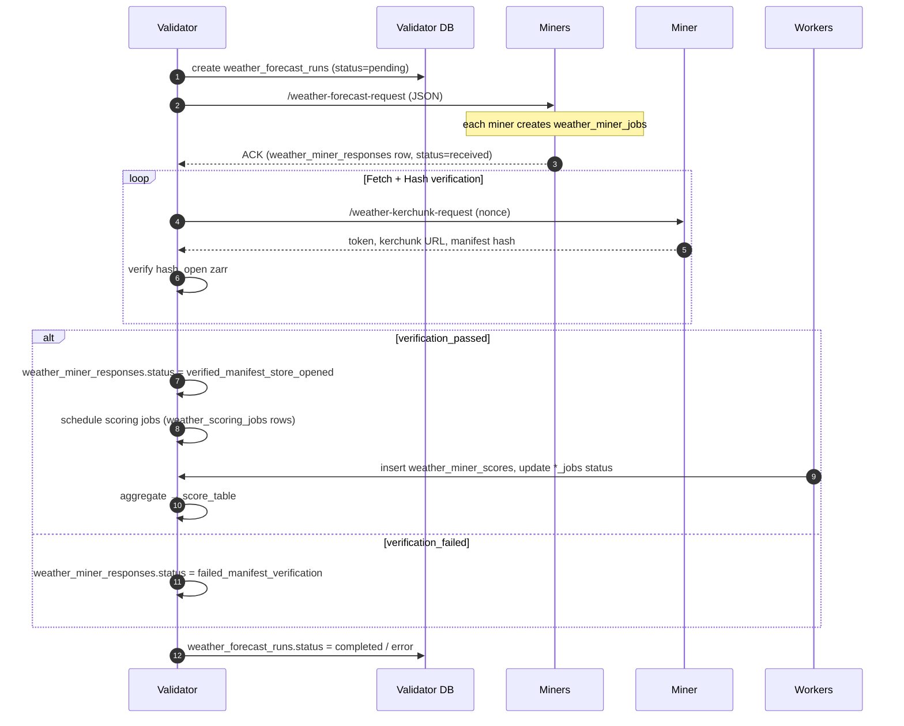
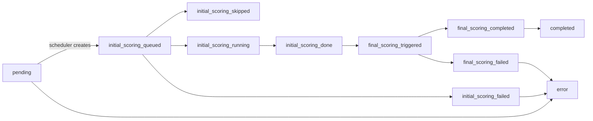
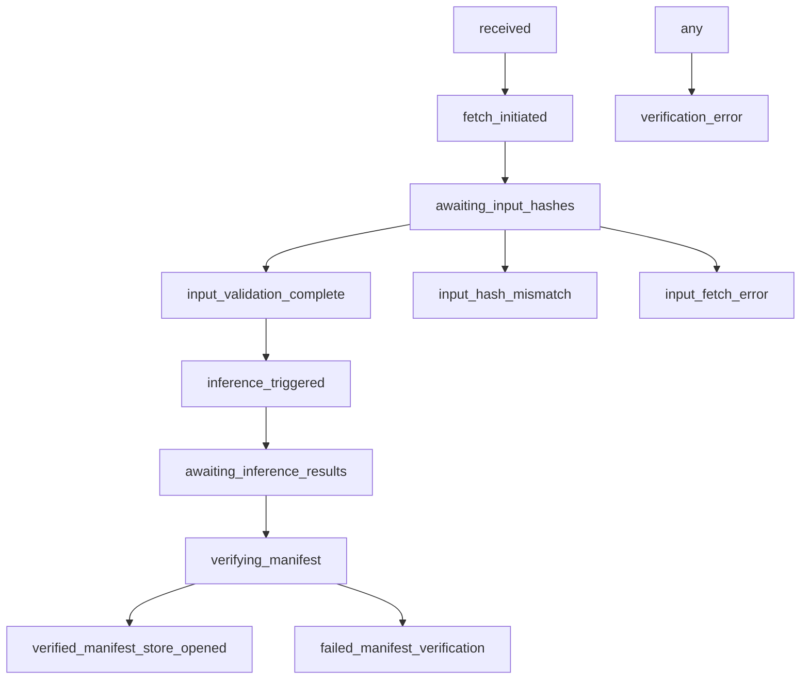
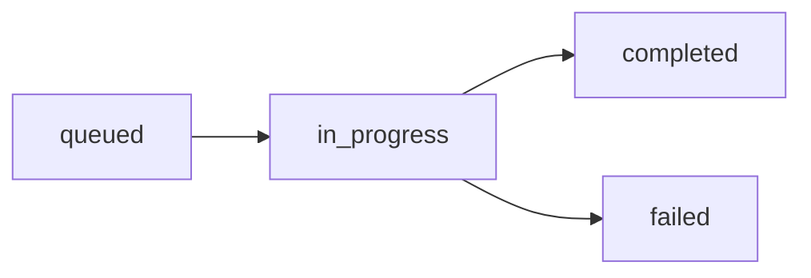

# Weather Task – Unified Protocol & Resilience Reference

> **Version:** 2024-07-02  
> **Applies to:** `gaia.tasks.defined_tasks.weather.*` (validator & miner)  
> **Author:** generated by AI assistant

---

## 1  High-Level Overview



This diagram shows the **happy-path** interactions.  Each rectangular DB write represents a **persistent checkpoint** – on restart, workers read the table state and resume.

<br/>

## 2  Database Tables & Key Columns

| Table | PK | Important Columns | Description |
|-------|----|------------------|-------------|
| `weather_forecast_runs` | `id` | `run_initiation_time`, `gfs_init_time_utc`, `status`, `completion_time`, `error_message` | One row per validator-initiated forecast run. Master record that other tables reference. |
| `weather_miner_responses` | `id` | `run_id` (FK), `miner_uid`, `status`, `job_id`, `verification_hash_*`, `error_message` | One row per miner per run. Tracks full lifecycle from receipt → verification. |
| `weather_miner_scores` | `id` | `response_id` (FK), `run_id`, `score_type`, `lead_hours`, `variable_level`, `score`, `error_message` | Holds individual metric sets. Multiple rows per response (e.g. different lead hours). |
| `weather_scoring_jobs` | `id` | `run_id`, `score_type`, `status`, `started_at`, `completed_at`, `error_message` | Persistent job queue enabling idempotent scoring. |
| `weather_ensemble_forecasts` | `id` | `forecast_run_id`, `ensemble_path`, `status`, `error_message` | Tracks validator-side ensemble generation. |
| `weather_ensemble_components` | … | `ensemble_id`, `response_id`, `weight` | Links miner responses to an ensemble. |
| `weather_historical_weights` | (composite) | `miner_hotkey`, `run_id`, `score_type`, `weight` | Historical miner weights (not critical for restart). |
| `weather_miner_jobs` *(miner DB)* | `id` | `gfs_init_time_utc`, `status`, `target_netcdf_path`, `verification_hash`, `error_message` | Miner-side counterpart. |

> Every status column enumerated below constitutes a **state machine**; legal transitions are enforced by the worker coroutines.

<br/>

## 3  Status State-Machines

### 3.1  `weather_forecast_runs.status`



*Driver functions*
- `weather_logic._update_run_status()` – single‐point helper that all workers call.
- Startup recovery logic `_check_and_recover_incomplete_runs*` scans for runs **not** in a terminal state and re-queues missing steps.

### 3.2  `weather_miner_responses.status`



*Driver functions*
- `weather_task._continue_run_workflow()` & `miner_fetch_hash_worker` advance early states.
- `verify_miner_response()` moves to verification states.
- Cleanup worker deletes rows stuck > N days.

### 3.3  `weather_scoring_jobs.status`



Workers:
- `initial_scoring_worker` for `score_type='day1_qc'`
- `finalize_scores_worker` for `score_type='era5_final'`
  – both wrap each scoring pass with `_start_scoring_job` / `_complete_scoring_job` which guarantees **exactly-once** behaviour.

<br/>

## 4  Validator Workflow (detail)

| Step | Function(s) | Table writes | Notes |
|------|-------------|-------------|-------|
| **V-1** Scheduler | `validator_execute()` | INSERT `weather_forecast_runs` (pending) | Runs once per UTC day (config `run_hour_utc`).
| **V-2** GFS fetch & hash | `fetch_and_hash_gfs_task` | UPDATE `weather_forecast_runs` → `gfs_input_metadata` | Caches to local / R2; retry on network errors.
| **V-3** Broadcast request | `_continue_run_workflow` → `query_miners()` | INSERT `weather_miner_responses` (received) | Payload: `{job_id,gfs_init_time,hash}` signed with validator JWT.
| **V-4** Wait for miner file fetch | `miner_fetch_hash_worker` | status chain `fetch_initiated → awaiting_input_hashes` | Uses validator-polled hash comparison.
| **V-5** Trigger inference | `_trigger_single_miner()` | status `inference_triggered` then `awaiting_inference_results` | If using RunPod, also stores job_id.
| **V-6** Verification | `verify_miner_response()` | status to `verified_manifest_store_opened` or failure | Opens remote zarr via signed token + manifest hash.
| **V-7** Scoring jobs | `_create/_start/_complete_scoring_job` | INSERT/UPDATE `weather_scoring_jobs`, `weather_miner_scores` | Day-1 QC then ERA-5 final.
| **V-8** Aggregate & Write score row | `build_score_row()` | INSERT/UPDATE `score_table` | Also optional ensemble score.
| **V-9** Cleanup | `cleanup_worker`, `r2_cleanup_worker` | DELETE old blobs; UPDATE run status to completed | Uses retention env vars.

**Restart behaviour**: on validator startup, `_check_and_recover_incomplete_runs()` + `_recover_incomplete_scoring_jobs()` scan the above tables:  
• pending / in_progress → re-queue worker tasks  
• queued scoring jobs preserved via `weather_scoring_jobs` so workers continue idempotently.

<br/>

## 5  Miner Workflow (detail)

| Step | Function(s) | Table writes | Notes |
|------|-------------|-------------|-------|
| **M-1** Receive forecast request | `miner_execute()` entry | INSERT `weather_miner_jobs` (received) | Stores `validator_request_time`, `gfs_init_time_utc`.
| **M-2** Fetch GFS inputs | `prepare_miner_batch_from_payload()` | UPDATE `weather_miner_jobs` → `status=processing` | Writes pickle path + hash.
| **M-3** Run inference | `WeatherInferenceRunner` **or** HTTP / RunPod | UPDATE same row: `target_netcdf_path` + `verification_hash` + `status=completed` | Handles GPU semaphore / concurrency.
| **M-4** Respond to validator | returns JSON: `{job_id, status, verification_hash}`; validator inserts/updates `weather_miner_responses`.
| **M-5** Serve data | FastAPI route `/weather-kerchunk-request` returns signed JWT, zarr URL, manifest hash | Token TTL controlled by env `WEATHER_ACCESS_TOKEN_EXPIRE_MINUTES`.
| **M-6** Cleanup | `cleanup_worker`, `r2_cleanup_worker` | DELETE local/R2 artefacts per retention settings | Only after validator acknowledged.

Miner recovery: on startup `recover_incomplete_http_jobs()` re-opens any `weather_miner_jobs` with `status in ('in_progress','processing')` and resumes upload/inference as needed.

<br/>

## 6  Retry & Back-off Rules

| Context | Column(s) used | Max attempts | Delay schedule |
|---------|---------------|--------------|----------------|
| Hash verification failures | `weather_miner_responses.error_message` + status `input_hash_mismatch` | unlimited; validator moves to `verification_failed` eventually | `verification_wait_minutes` env (default 60).|
| Manifest verification failures | status `failed_manifest_verification` → no retry (miner forfeits) |
| Scoring job failure | `weather_scoring_jobs.retry` (implicit by rerunning) | 3 attempts by recovery loop |
| ERA5 download failure | era5 worker catches and reschedules in `_recover_incomplete_scoring_jobs()` |

All retries reuse the **same functions** (e.g. `_start_scoring_job`) so computation is identical to first run (DRY).

<br/>

## 7  Persistent Checkpoints & Recovery Hooks

| Checkpoint | Ensures idempotency | Recovery hook |
|------------|--------------------|---------------|
| `weather_forecast_runs.status` ≠ terminal | run re-queued | `_check_and_recover_incomplete_runs()` |
| `weather_scoring_jobs.status IN ('queued','in_progress')` | scoring resumed | `_recover_incomplete_scoring_jobs()` |
| `weather_miner_responses` rows without `verification_passed` | verifier will retry polling | `_execute_hash_verification_workflow()` |
| Miner `weather_miner_jobs.status` ∉ terminal | miner restarts job | `recover_incomplete_http_jobs()` |

<br/>

## 8  API / Payload Specifications

### 8.1  `/weather-forecast-request` (Validator ➜ Miner)
```jsonc
{
  "nonce": "<uuid>",
  "data": {
    "job_id": "<deterministic_task_id>",
    "gfs_init_time": "2024-07-02T18:00:00Z",
    "gfs_init_metadata": { /* file list, hashes */ },
    "input_data_hash": "<sha256>",
    "forecast_step_hours": 6,
    "inference_steps": 40
  }
}
```
*Miner must persist `job_id` & `gfs_init_time_utc` to `weather_miner_jobs`.*

### 8.2  `/weather-kerchunk-request` (Validator ➜ Miner)
Validator sends `{"nonce": ..., "data": {"job_id": "..."}}`

Miner responses:
```jsonc
{
  "status": "completed" | "processing" | "error" | "not_found",
  "access_token": "<JWT>"?,
  "zarr_store_url": "https://miner-ip:port/zarr/<job_id>/",
  "verification_hash": "<sha256>"
}
```

Validator opens remote zarr store with header `Authorization: Bearer <JWT>` and computes manifest hash for comparison.

<br/>

## 9  Environment Variables & Tunables (excerpt)

| Var | Default | Purpose |
|-----|---------|---------|
| `WEATHER_RUN_HOUR_UTC` / `WEATHER_RUN_MINUTE_UTC` | `18:00` | Daily scheduler time |
| `WEATHER_INITIAL_SCORING_LEAD_HOURS` | `6,12` | Lead hours for day-1 QC |
| `WEATHER_VERIFICATION_WAIT_MINUTES` | `60` | How long validator waits for miner to upload input |
| `WEATHER_ACCESS_TOKEN_EXPIRE_MINUTES` | `120` | JWT lifetime for zarr access |
| `WEATHER_R2_CLEANUP_ENABLED` | `true` | Enable R2 blob GC on miner |

(See `_load_config()` in `weather_task.py` for full list.)

<br/>

## 10  Known Gaps & Improvement TODOs

1. `weather_miner_jobs.status` lacks explicit value for *verification_failed* – minor inconsistency with validator side.
2. Cleanup worker may delete R2 artefacts before final ERA-5 scoring if `verification_wait_minutes` > retention – adjust defaults.
3. Ensemble scoring currently optional; ensure restart logic retries failed ensemble creation.
4. Back-off strategy for `failed_manifest_verification` is currently "no retry" – consider one manual retry if miner uploads repaired data.

---

### End of Document 